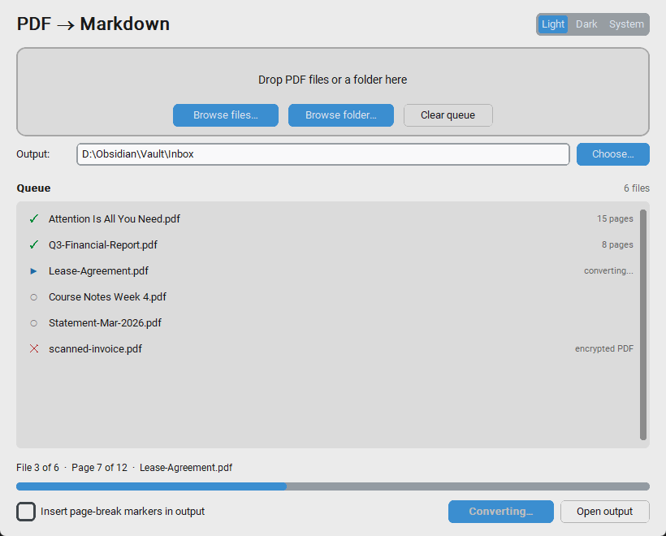
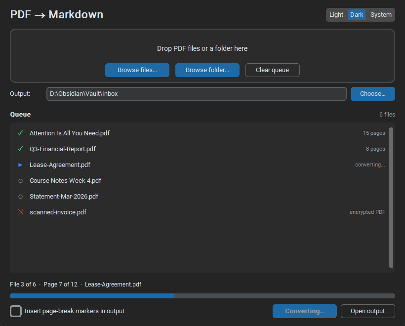

# PdfToMarkdown

A CPU-only PDF-to-Markdown converter built for AI data extraction pipelines.
Reconstructs reading order, detects heading hierarchy, extracts bordered tables,
and processes PDFs in bulk, all locally, with no GPU, no Java, no Ghostscript,
and no data ever leaving your machine.

---

## Screenshots

The conversion queue mid-run, with per-file status marks and the combined
progress bar:



The same window using the built-in dark theme:



---

## Why I built this

I kept hitting the same wall from two different directions.

**I wanted these conversions to stay private.** The PDFs I most wanted to
convert were the ones I was least willing to upload: statements, letters,
contracts, paid-for research. Every "drop your PDF here" website is somebody
else's server, and the honest answer to *"what happens to my file after this?"*
is that you have no way to know. I wanted a converter where that question has a
verifiable answer, so this one has no networking code in it at all: no uploads,
no telemetry, no API calls, nothing to audit because there's nothing there.
Everything runs on the CPU, on your machine, offline.

**I use Obsidian heavily, and a vault is only as good as what you can get into
it.** A PDF sitting in a folder is a dead end. You can't link it, backlink it,
search it properly, or fold it into a note. Markdown is the native currency of
that whole workflow. So the target was never just "extract the text"; it was
"produce a file I'd actually want in my vault": real `#` headings that populate
the outline pane, real tables, paragraphs that survived the trip intact.

That second requirement is what made this more interesting to build than it
looks. Pulling characters out of a PDF is a solved problem. The hard part is
that **a PDF has no structure to extract**. It stores glyphs at coordinates,
not headings and paragraphs. Deciding that *this* 18 pt line is an H2 while
*that* one is just an emphasised sentence means inferring the document's
hierarchy from font sizes, spacing, and layout geometry. The two-pass heading
detection and column-aware reading-order reconstruction described below are
where most of the real work went.

Key design goals:

- **Private by construction**: no network code in the codebase; files never leave your machine
- **CPU-only**: runs on any laptop; no GPU, no Java, no Ghostscript
- **Obsidian-ready**: output drops straight into a vault as first-class Markdown
- **Spec-grounded**: based on PDF/A specification principles ([pdfa.org](https://pdfa.org/))
- **Bulk-ready**: point it at a folder, walk away, come back to a folder of `.md` files

---

## Features

| Feature | How it works |
|---|---|
| **Reading order reconstruction** | Detects multi-column layouts via x-coordinate gap analysis, then sorts blocks top-to-bottom within each column. |
| **Heading hierarchy (H1 / H2 / H3)** | Two-pass scan: collects every character's font size across the whole document, ranks unique sizes, and assigns the largest to H1, next to H2, third to H3. Falls back to bold-text and ALL-CAPS detection. |
| **Paragraph segmentation** | Splits on large vertical gaps **or** ≥ 8 % font-size changes between consecutive lines. |
| **Bordered table extraction** | Uses pdfplumber's lattice strategy (looks for actual ruling lines), so no Java or Ghostscript dependency. |
| **List detection** | Recognises bullet (`•‣●◦–-*`) and numbered (`1.`, `1)`) prefixes. |
| **Bulk processing** | Drop a folder of PDFs in, get a folder of Markdown files out, with per-file and per-page progress. |
| **GUI + CLI** | Drag-and-drop desktop GUI (customtkinter) for manual use, headless `--cli` mode for scripting and automation. |

---

## Download

Prebuilt desktop builds are published on the
[Releases page](https://github.com/ASmallBurger/PdfToMarkdown/releases/latest).
Download the archive for your platform, unzip it, and run the app. No Python
installation and no setup required.

The Windows build is a folder containing `PdfToMarkdown.exe` plus an
`_internal` directory. Keep them together and launch the `.exe`.

> **First launch on Windows.** The executable is not code-signed, so
> SmartScreen will show a "Windows protected your PC" dialog the first time.
> Choose **More info** then **Run anyway**. Signing requires a paid
> certificate; see [Limitations](#limitations).

---

## Run from source

Requires Python 3.10 or newer.

```bash
git clone https://github.com/ASmallBurger/PdfToMarkdown
cd PdfToMarkdown
pip install -r requirements.txt
```

That's it. Five pure-Python dependencies, all CPU-only:

| Package | Purpose |
|---|---|
| `pdfplumber` ≥ 0.11 | PDF parsing (wraps pdfminer.six) |
| `pdfminer.six` ≥ 20221105 | Low-level glyph/layout access |
| `Pillow` ≥ 10.0 | Image handling for pdfplumber |
| `customtkinter` ≥ 5.2 | Themed GUI widgets |
| `tkinterdnd2` ≥ 0.4 | Drag-and-drop support |

No Java. No Ghostscript. No GPU. No external services.

### Building the executable

```bash
pip install pyinstaller
pyinstaller PdfToMarkdown.spec --noconfirm --clean
```

The result lands in `dist/PdfToMarkdown/`.

[`PdfToMarkdown.spec`](PdfToMarkdown.spec) handles three things that a plain
`pyinstaller main.py` gets wrong:

- **customtkinter assets.** Its themes, fonts, and icons live under `assets/`
  and are read relative to the package at runtime. PyInstaller has no hook for
  the package, so they are declared explicitly.
- **The tkdnd Tcl extension.** tkinterdnd2 appends `tkdnd/<platform>` to Tcl's
  `auto_path` at import time. Only the host platform's build is bundled, which
  keeps about 1.3 MB of other-OS binaries out of the output.
- **pygame.** `pdfminer.ccitt` imports it inside a debug bitmap-viewer class
  that normal decoding never reaches, but static analysis still pulls the whole
  library in. Excluding it saves roughly 14 MB.

The spec detects the host platform, so it should also work on macOS and Linux,
though only the Windows build has been tested.

---

## Usage

### GUI mode

```bash
python main.py
```

A window appears with:

- A **drag-and-drop zone**: drop individual PDFs or a whole folder onto it
  (browse buttons are there too)
- An **output folder** picker, remembered between sessions
- A **conversion queue** showing every file with a live status mark
  (○ pending · ▶ converting · ✓ done · ✕ failed) and its page count
- A single labelled progress bar: *"File 2 of 5 · Page 3 of 12"*
- A **Light / Dark / System** theme toggle
- An **Open output** button that reveals the results in your file manager

Conversion runs on a background thread, so the window stays responsive on
hundred-page PDFs. Failures are isolated per file: one corrupt or
password-protected PDF marks that row red and the queue carries on.

Your last-used folders, theme, and options are saved to
`~/.pdftomarkdown_prefs.json` so the app opens where you left off.

### CLI mode

```bash
# Single file
python main.py --cli report.pdf out/

# Whole folder
python main.py --cli ./papers/ ./markdown/

# With page-break markers in the output
python main.py --cli report.pdf out/ --page-breaks
```

Each input `*.pdf` becomes `*.md` in the output directory.

---

## Project layout

```
PdfToMarkdown/
├── main.py                # Entry point: GUI launcher and --cli dispatcher
├── requirements.txt
├── parser/
│   ├── extractor.py       # Two-pass PDF extraction; reading order; headings; tables
│   ├── converter.py       # PageContent → Markdown string
│   └── processor.py       # Bulk-file orchestration + progress callbacks
└── gui/
    └── app.py             # customtkinter window, drag-drop, queue (thread-safe)
```

---

## How heading detection works

Most converters use a fixed font-size threshold (e.g. "anything ≥ 18 pt is a
heading"), which falls apart on documents with non-standard sizing.
PdfToMarkdown does it relatively, in two passes:

1. **Pass 1**: read every character on every page, compute the median size
   (this is the body text baseline), then collect every distinct size larger
   than the baseline.
2. **Pass 2**: cluster nearby sizes (within 8 %), sort the clusters
   descending, and map them to heading levels: largest → H1, next → H2, third
   → H3.

So if your document has 22-pt section titles and 16-pt subheadings, those
become H1 and H2, even though neither matches a hardcoded threshold.

A bold-only fallback catches headings that are body-sized but visually
emphasised (e.g. inline section labels).

---

## How table extraction works

Tables are detected using pdfplumber's **lattice strategy**, which looks for
actual ruling lines drawn in the PDF. This is reliable for bordered tables
(financial reports, scientific papers, forms) and avoids the heuristic
guesswork that "stream" strategies need.

Words that fall inside a detected table's bounding box are excluded from the
text-block extraction, so you never get duplicated content.

Currently borderless tables are not detected as tables. They fall through to
the regular text-extraction path.

---

## Limitations

- **Borderless tables** are not detected as tables (treated as paragraphs).
- **Scanned PDFs / images** are not OCR'd. If the PDF is just embedded images
  with no text layer, output will be empty. Run an OCR pass first
  (e.g. `ocrmypdf`) to add a text layer.
- **Complex multi-column layouts** with > 2 columns may have imperfect
  reading order.
- **Math/equations** are extracted as plain text in whatever Unicode the PDF
  embeds; no LaTeX reconstruction.
- **Footnotes and headers/footers** are not separated from body text.
- **The released binary is unsigned**, so Windows SmartScreen and macOS
  Gatekeeper will warn on first launch. Code-signing certificates are a
  recurring paid cost and are not in place yet.

---

## Roadmap

- Borderless table detection
- Optional OCR pre-pass via `ocrmypdf`
- Image extraction with `` references
- Footnote / header / footer separation
- Standalone executable builds (Windows `.exe`, Mac `.app`)

---

## License

Released under the [MIT License](LICENSE). You are free to use, modify,
and distribute this software, including commercially, provided the copyright
notice is retained.
